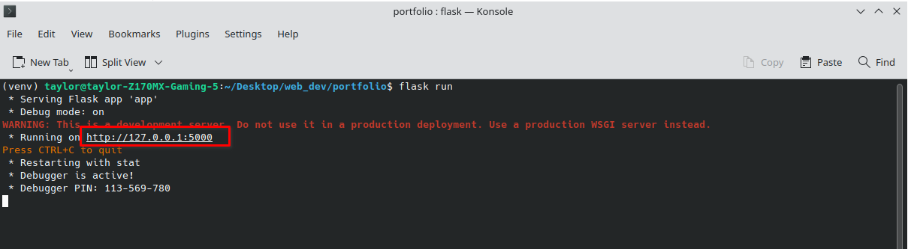

# Portfolio

## Installation

1. Navigate to your terminal
2. Create a virtual environment:

Windows

`python -m venv venv`&#x20;

`Linux/Mac`

`python3 -m venv venv`

3. Activate the virtual environment:

Windows

`.\venv\Scripts\activate`

`Linux/Mac`

`source venv/bin/activate`

4. Install dependencies using the `requirements.txt` file within the virtual environment:

`pip install -r requirements.txt`

4. Run flask:

`flask run`

```
```

6. Simple hold ctrl or cmd and click on the local host link (127.0.01) as show below

<figure><figcaption></figcaption></figure>
